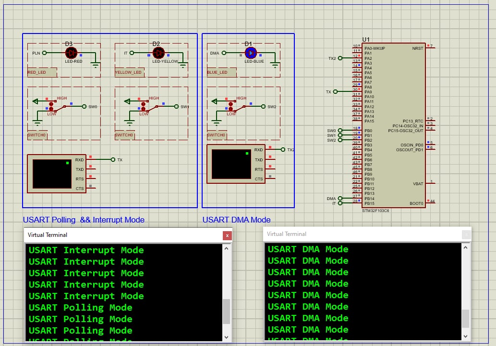

# STM32 USART Communication Modes Implementation

## 📌 Overview
This project demonstrates how to implement three USART communication modes—Polling, Interrupt, and DMA—on an STM32F103C6 (Blue Pill) microcontroller. Each mode is activated via a button press and confirmed using LED indicators. The USART data is sent to a terminal application via USB-TTL.

---

## 🛠️ Hardware Requirements

  
- STM32F103C6 MCU (Blue Pill)
- USB-TTL converter (CP2102 / FT232)
- 3x Tactile buttons (connected to PB0, PB1, PB2)
- 2x LEDs (connected to PB14, PB15) with 220Ω resistors
- Breadboard and jumper wires

---

## 💻 Software Requirements

- STM32CubeMX v6.0 or later
- STM32CubeIDE v1.8 or later
- Serial Terminal (Putty, TeraTerm) v0.78 or later
- *(Optional)* Proteus 8 Professional for simulation

---

## 🔧 USART Communication Modes Configuration

### ▶️ Polling Mode (USART1)
- **Baud Rate:** 9600  
- **Word Length:** 8 bits  
- **Stop Bits:** 1  
- **Parity:** None  
- **Trigger:** PB0 button press  
- **Function Used:** `HAL_UART_Transmit()`

### 🔔 Interrupt Mode (USART1)
- **Configuration:** Same as Polling  
- **Trigger:** PB1 button press  
- **Function Used:** `HAL_UART_Transmit_IT()`  
- **Callback:** Toggles LED on PB15

### 📤 DMA Mode (USART2)
- **DMA Controller:** DMA1  
- **Channel:** Channel 7 (USART2_TX)  
- **Priority:** Highest (0)  
- **Trigger:** PB2 button press  
- **Function Used:** `HAL_UART_Transmit_DMA()`  
- **Callback:** Toggles LED on PB14

---

## ⚙️ Setup Instructions

1. STM32CubeMX Configuration

 - Create new STM32F103C6 project
 - Set system clock to 32MHz (HSI → PLL ×4)
 - Configure USART1 and USART2 as Asynchronous
 - Enable DMA for USART2_TX
 - GPIO configuration:
   - PB0, PB1, PB2 as input (pull-down or pull-up)
   - PB14, PB15 as output
 - Generate initialization code

 2. In STM32CubeIDE:
   - Open generated project
   - Add application logic in main.c
   - Implement ISRs in stm32f1xx_it.c
   - Build and debug

3. For Proteus:
   - Add STM32F103C6 to schematic
   - Connect test components (LEDs/buttons)
   - Load compiled .hex file
   - Start simulation

## Troubleshooting
- No serial output      ? → Verify TX/RX connections are crossed correctly
- Buttons not working   ? → Ensure proper pull-up or pull-down resistors
- DMA not transmitting  ? → Confirm DMA settings and channel in CubeMXn
- LEDs not toggling     ? → Check your callback function implementation
- Garbled terminal text ? → Confirm terminal is set to 9600 baud

## License
MIT License - Free for all uses with attribution
