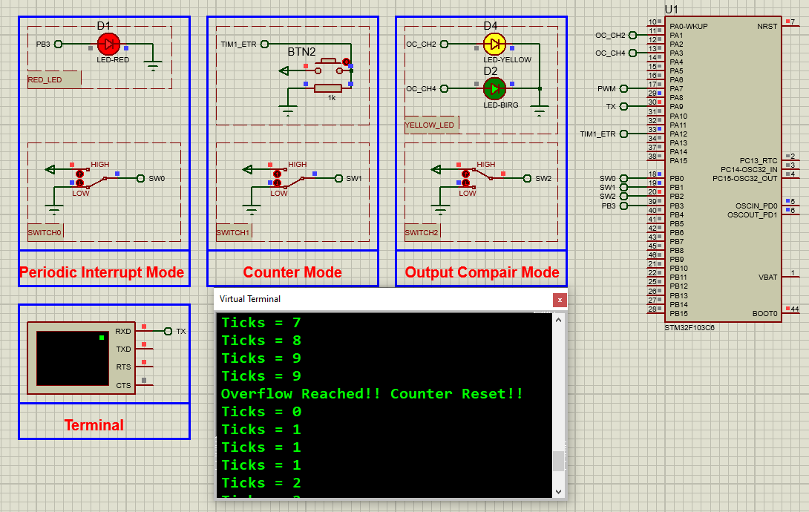

# STM32 Timer Modes Implementation

## Hardware Requirements

- STM32F103C6 MCU
- LED, button, resistor components for testing
- USB-STLink programmer (for real hardware)

## Software Requirements
- STM32CubeMX v6.0+
- STM32CubeIDE v1.8+
- Proteus 8 Professional (for simulation) v8.15+

## Timer Configurations
**Periodic Interrupt (TIM3):**
- Prescaler=1000, Counter Period=32000 → 100ms interrupts
- NVIC: TIM3 global interrupt enabled
- Use for: Time-critical tasks, sensor polling

**Counter Mode (TIM1):**
- Clock Source: ETR2 (PA12 pin)
- Counter Mode=Up, Period=10
- Auto-reload enabled
- Use for: Event counting, frequency measurement

**Output Compare (TIM2):**
- Prescaler=3200-1, Period=1000
- CH2: Toggle on match, Pulse=200
- CH4: Toggle on match, Pulse=400
- Use for: PWM generation, motor control

## Setup Steps
1. In STM32CubeMX:
   - Create STM32F103C6 project
   - Set system clock to 32MHz
   - Configure TIM1/2/3 as above
   - Generate code

2. In STM32CubeIDE:
   - Open generated project
   - Add application logic in main.c
   - Implement ISRs in stm32f1xx_it.c
   - Build and debug

3. For Proteus:
   - Add STM32F103C6 to schematic
   - Connect test components (LEDs/buttons)
   - Load compiled .hex file
   - Start simulation

## Troubleshooting
- No interrupts? → Check NVIC configuration
- Wrong timing? → Verify clock tree and prescaler
- No output? → Confirm GPIO alternate function
- Simulation issues? → Check component connections

## License
MIT License - Free for all uses with attribution