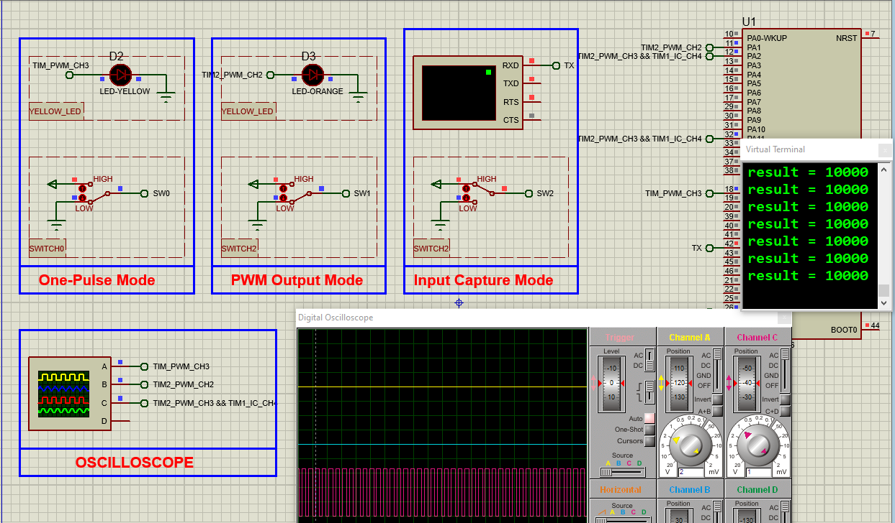

# STM32 One-Pulse PWM with Input Capture

## Hardware Requirements

- STM32F103C6 MCU
- Push buttons, LEDs, resistors for testing
- USB-STLink programmer (for real hardware)
- Oscilloscope (optional for verification)

## Software Requirements
- STM32CubeMX v6.0+
- STM32CubeIDE v1.8+
- Proteus 8 Professional v8.15+ (for simulation)

## Timer Configurations
**One-Pulse PWM Mode:**
- Prescaler=79, Auto-reload=999
- OPM bit set in CR1 register
- Use for: Single-shot triggers, precision timing

**Input Capture Mode:**
- CC1 channel configured as input
- Capture enabled (CC1E bit set)
- Use for: Pulse-width measurement, frequency analysis

## Setup Steps
1. In STM32CubeMX:
   - Create STM32F103C6 project
   - Set system clock to 32MHz
   - Configure Timer in One-Pulse mode
   - Setup Input Capture channel
   - Generate code

2. In STM32CubeIDE:
   - Open generated project
   - Add pulse generation logic in main.c
   - Implement capture measurement code
   - Build and debug

3. For Proteus:
   - Add STM32F103C6 to schematic
   - Connect test components and probes
   - Load compiled .hex file
   - Start simulation and verify timing

## Troubleshooting
- No pulse generated? → Check trigger configuration
- Incorrect measurements? → Verify capture settings
- Simulation not working? → Confirm probe connections
- Unexpected behavior? → Review clock configuration

## License
MIT License - Free for all uses with attribution