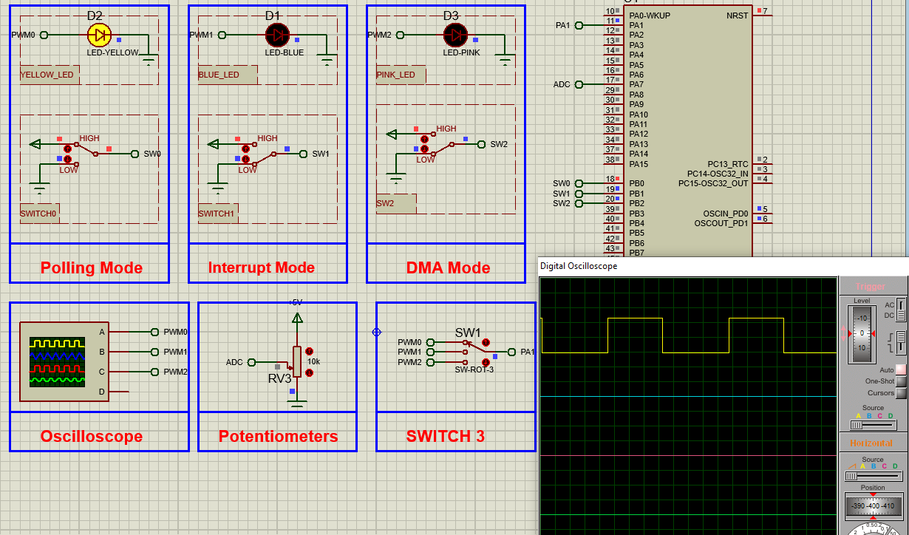

# STM32 ADC Modes: Polling, Interrupt & DMA

## Hardware Requirements

- STM32F103C6 MCU
- Potentiometer (for analog input testing)
- LED indicators (for output verification)

## Software Requirements
- STM32CubeMX v6.0+
- STM32CubeIDE v1.8+
- Proteus 8 Professional v8.15+ (for simulation)

## ADC Configurations
**Polling Mode:**
- Single conversion mode
- Software-triggered
- Use for: Simple occasional measurements

**Interrupt Mode:**
- Continuous conversion
- EOC interrupt enabled
- Use for: Medium-frequency sampling

**DMA Mode:**
- Circular buffer mode
- DMA linked to ADC
- Use for: High-speed continuous sampling

## Setup Steps
1. In STM32CubeMX:
   - Create STM32F103C6 project
   - Configure ADC1 with 3 channels
   - Set modes for Polling/Interrupt/DMA
   - Generate code

2. In STM32CubeIDE:
   - Open generated project
   - For Polling: Add ADC_Start/ADC_PollForConversion
   - For Interrupt: Implement ADC_IRQHandler
   - For DMA: Setup buffer and enable DMA
   - Build and debug

3. For Proteus:
   - Add STM32F103C6 and analog source
   - Connect virtual instruments
   - Load firmware and test all modes

## Troubleshooting
- No readings? → Check ADC channel assignments
- Inconsistent values? → Verify reference voltage
- DMA not working? → Confirm buffer alignment
- Interrupts missing? → Check NVIC configuration

## License
MIT License - Free for all uses with attribution