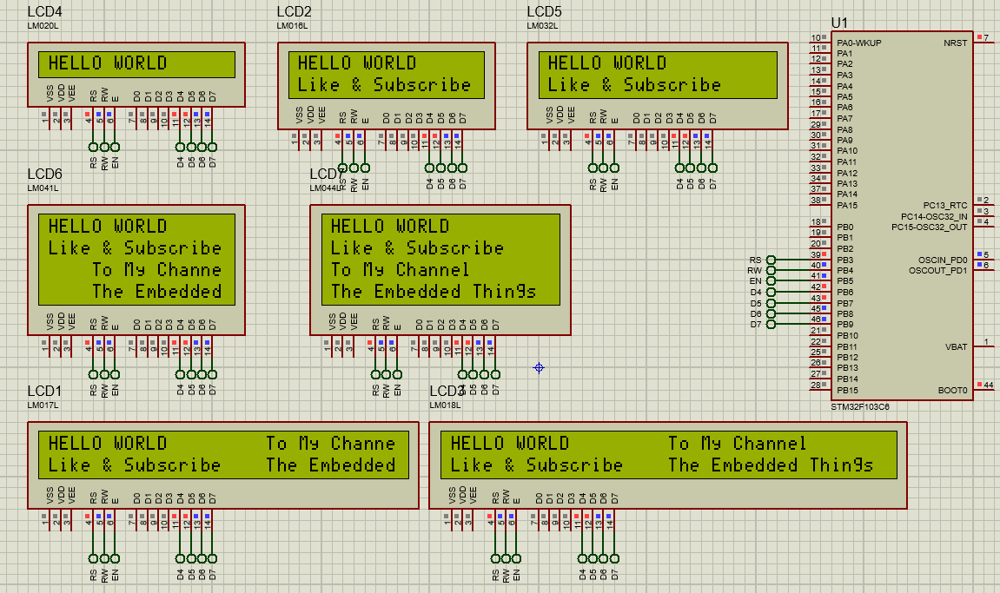

# STM32 LCD Interface for Multiple Displays

## Hardware Requirements

- STM32F103C6 MCU
- 16x2 LCD Display (HD44780 controller)
- 20x4 LCD Display (optional second display)
- Potentiometer for contrast control
- 220Ω resistors for backlight
- Breadboard and jumper wires

## Software Requirements
- STM32CubeMX v6.0+
- STM32CubeIDE v1.8+
- Proteus 8 Professional v8.15+ (for simulation)

## LCD Configuration (4-Bit Mode)
**GPIO Connections:**
- RS: PB3
- EN: PB4
- D4: PB5
- D5: PB6
- D6: PB7
- D7: PB8

**Key Settings:**
- 3.3V logic compatible with 5V LCD
- 8MHz system clock
- No pull-up resistors required

## Setup Steps
1. In STM32CubeMX:
   - Create STM32F103C6 project
   - Set system clock to 8MHz
   - Configure PB3-PB8 as GPIO Output
   - Generate initialization code

2. In STM32CubeIDE:
   - Create LiquidCrystal.h/.c files
   - Implement 4-bit communication functions:
     - lcd_init()
     - lcd_send_cmd()
     - lcd_send_data()
   - Write display logic in main.c

3. For Proteus:
   - Add STM32F103C6 and LCD components
   - Connect pins according to configuration
   - Load firmware and test display output

## Multiple Display Setup
1. Share data pins (D4-D7) between displays
2. Use separate RS/EN pins for each LCD
3. Initialize displays sequentially
4. Control independently using separate enable signals

## Troubleshooting
- No display? → Check contrast potentiometer
- Garbled text? → Verify initialization sequence
- Missing characters? → Review timing delays
- Simulation issues? → Confirm pin mappings

## License
MIT License - Free for all uses with attribution