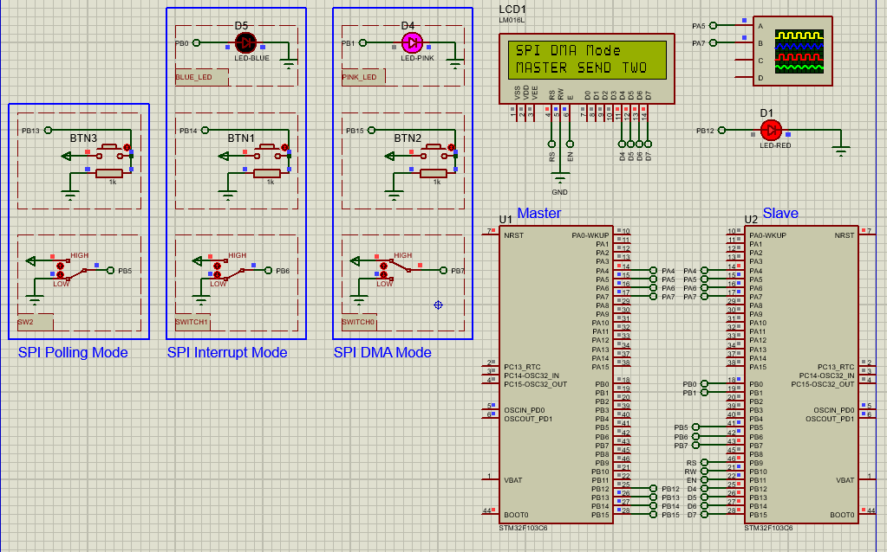

# STM32 SPI Communication: Polling, Interrupt & DMA

## Hardware Requirements

- 2x STM32F103C6 MCUs (Master/Slave)
- 16x2 LCD Display (for slave output)
- Push buttons (mode selection)
- LEDs (status indicators)
- USB-STLink programmers

## Software Requirements
- STM32CubeMX v6.0+
- STM32CubeIDE v1.8+
- Proteus 8 Professional v8.15+

## Communication Modes
**Polling Mode:**
- Blocking transmission/reception
- Simple implementation
- Use for: Low-frequency transfers

**Interrupt Mode:**
- Non-blocking operation
- Medium efficiency
- Use for: Event-driven systems

**DMA Mode:**
- Zero CPU overhead
- Maximum efficiency
- Use for: High-speed streaming

## Setup Steps
1. **Master Board Setup**:
   - Configure SPI1 as Master
   - Set pins: PB12(SCK), PB13(MISO), PB14(MOSI)
   - Implement all 3 transfer modes

2. **Slave Board Setup**:
   - Configure SPI1 as Slave
   - Connect LCD to PB9-PB15
   - Implement receive handlers

3. **Proteus Simulation**:
   - Connect both STM32 models
   - Add LCD and control buttons
   - Monitor with virtual oscilloscope

## Troubleshooting
- No communication? → Check SCK signal
- Data corruption? → Verify phase/polarity
- DMA issues? → Confirm buffer alignment
- Slave not responding? → Check NSS pin

## License
MIT License - Free for all uses with attribution