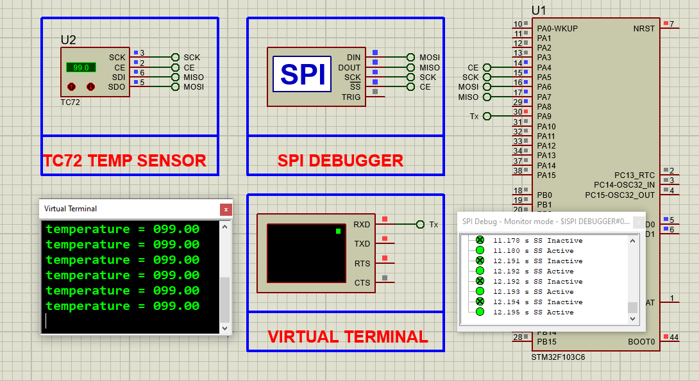

# STM32 TC72 Temperature Sensor via SPI

## Hardware Requirements

- **MCU**: STM32F103C6  
- **Sensor**: TC72 temperature sensor  
- **Display**: Virtual Terminal (for UART output)  
- **Debugger**: SPI Debugger (for monitoring)  
- **Other**: Breadboard and jumper wires  

## Pin Connections

| TC72 Pin | STM32 Pin | Function     |
|----------|-----------|--------------|
| SCK (3)  | PB13      | SPI Clock    |
| CE (2)   | PA4       | Chip Enable  |
| SDI (5)  | PB15      | MOSI         |
| SDO (6)  | PB14      | MISO         |
| VCC      | 3.3V      | Power        |
| GND      | GND       | Ground       |

## Software Requirements

- STM32CubeMX v6.0+  
- STM32CubeIDE v1.8+  
- Virtual Serial Terminal (e.g., PuTTY, Tera Term)  
- Proteus 8 Professional v8.15+ (optional for simulation)  

## Setup Steps

### STM32CubeMX Setup

- Create a new project for STM32F103C6  
- Set system clock to 8MHz  
- Configure SPI1 as Full Duplex Master  
- Set SPI parameters:
  - Mode: 0 (CPOL = 0, CPHA = 0)  
  - Prescaler to get ~1MHz SPI clock  
- Set GPIO pins:
  - PA4 as Output (CE / Chip Enable)
  - Optional: UART TX for terminal output  
- Generate initialization code  

### STM32CubeIDE

- Create `tc72.h` and `tc72.c` files  
- Implement functions:
  - `void TC72_Init(void);`  
  - `float TC72_ReadTemperature(void);`  
  - `uint8_t TC72_ReadRegister(uint8_t reg);`  
  - `void TC72_WriteRegister(uint8_t reg, uint8_t data);`  
- Write logic in `main.c`:
  - Initialize SPI and CE pin  
  - Read temperature in loop  
  - Print result over UART  

### Proteus 

- Add STM32F103C6, TC72 sensor, SPI Debugger, Virtual Terminal  
- Connect according to pin configuration  
- Load compiled firmware  
- Observe temperature output and SPI activity  

## SPI Configuration

- **Mode**: 0 (CPOL=0, CPHA=0)  
- **Clock Speed**: 1MHz  
- **Chip Select**: Manual (via CE GPIO)  

## Expected Output

Virtual Terminal displays:
    temperature = 25.50 °C
    temperature = 25.75 °C

## Troubleshooting

- **Constant 699°C readings**: CE not toggled correctly  
- **No data**: Check SPI mode and wiring  
- **Garbage values**: Verify MISO connection  
- **Debugging**: Use SPI monitor or logic analyzer  

## License

MIT License – Free for all uses with attribution
