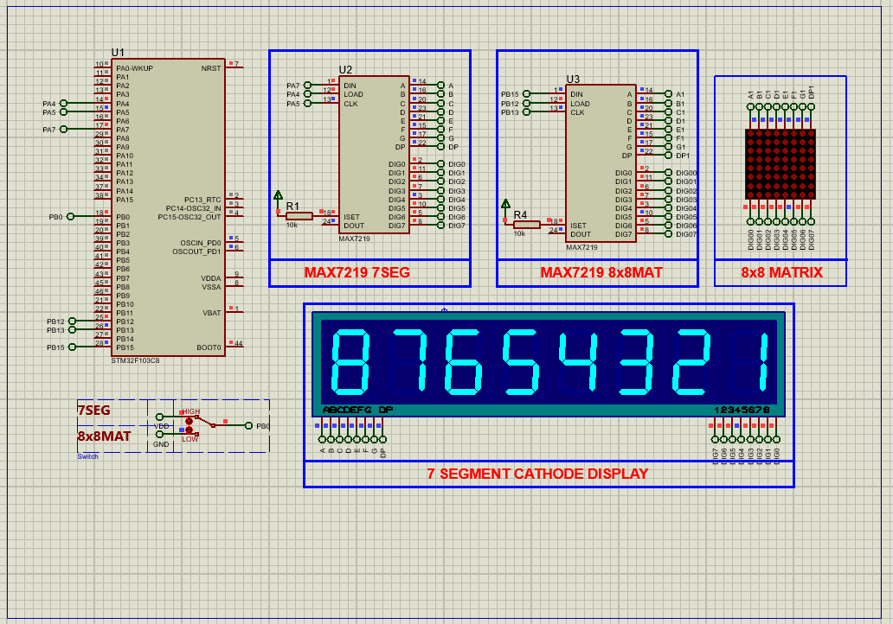

# STM32 MAX7219 Display Interface (SPI)

## Hardware Requirements

   - **MCU**: STM32F103C6
   - **Display Driver**: MAX7219 IC
   - **Displays**: 
   - 8×8 LED Matrix
   - 8-digit 7-segment display
   - **Pin Connections**: 
      | MAX7219 Pin | STM32 Pin | Function    |
      |-------------|-----------|-------------|
      | DIN         | PB15      | MOSI        |
      | CS          | PA4       | Chip Select |
      | CLK         | PB13      | SCK         |
      | VCC         | 3.3V      | Power       |
      | GND         | GND       | Ground      |

## Software Requirements
   - STM32CubeMX v6.0+
   - STM32CubeIDE v1.8+
   - Proteus 8 Professional v8.15+ (for simulation)

## Setup Steps
   ### STM32CubeMX Setup
      - Create new project for STM32F103C6
      - Set system clock to 8MHz
      - Configure SPI1 as Transmit Only Master
      - Set GPIO pins:
         - PA4 as Output (Chip Select)
         - PB0 as Output (Matrix control)
         - PB12 as Output (Secondary CS)
      - Generate initialization code

   ### In STM32CubeIDE:
      - Create MAX7219 .h/.c files
      - Implement functions:
         - max7219_Init_16SEG(uint8_t intensivity);
         - max7219_SetIntensivity(uint8_t intensivity);
         - max7219_Clean(void);
         - max7219_SendData(uint8_t addr, uint8_t data);
         - max7219_Turn_On(void);
         - max7219_Turn_Off(void);
         - max7219_Decode_On(void);
         - max7219_Decode_Off(void);
      - Write  logic in main.c

   ### In Proteus:
      - Add STM32F103C6 , MAX7219 ,  MATRIX 8×8 RED , 7SEG_MPX8_CC_BLUE , RES
      - Connect pins according to configuration
      - Load firmware and test display output

## Troubleshooting
   - No display: Check power and SPI connections
   - Flickering: Adjust brightness (Register 0x0A)
   - Missing segments: Verify scan limit (Register 0x0B)
   - Incorrect data: Confirm SPI Mode 0 settings

## License
   MIT License - Free for all uses with attribution