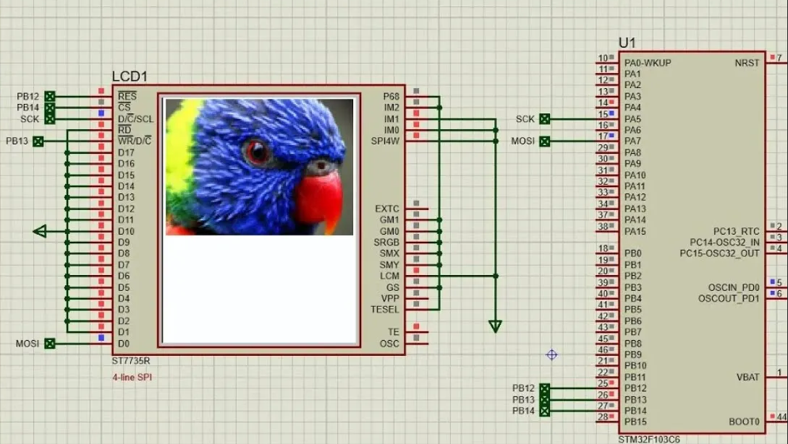

# STM32 ST7735 TFT LCD Display Interface (SPI)

## Hardware Requirements  


- **MCU**: STM32F103C6  
- **Display Driver**: ST7735R  
- **Display**: 1.8" 128x160 TFT LCD  
- **Pin Connections**:

| ST7735 Pin | STM32 Pin | Function         |
|------------|-----------|------------------|
| SCK        | PB13      | SPI Clock (SCL)  |
| MOSI       | PB15      | SPI Data (SDA)   |
| RES        | PB12      | Reset            |
| DC         | PB14      | Data/Command     |
| CS         | PB0       | Chip Select      |
| VCC        | 3.3V      | Power            |
| GND        | GND       | Ground           |

## Software Requirements  
- STM32CubeMX v6.0+  
- STM32CubeIDE v1.8+  
- Proteus 8 Professional v8.15+ (for simulation)

## Setup Steps

### STM32CubeMX Setup  
- Create new project for STM32F103C6  
- Set RCC → High Speed Clock (HSE) to **Crystal/Ceramic Resonator**  
- Go to Clock Configuration and set the system clock to **72MHz**  
- Configure SPI1 as **Transmit Only Master**  
- Configure GPIO Pins:  
  - PB12 as Output (Reset)  
  - PB13 as SPI1_SCK  
  - PB14 as Output (DC)  
  - PB15 as SPI1_MOSI  
  - PB0 as Output (CS)  
- Set SPI1 Prescaler to 16 (for baud rate)  
- Generate initialization code

### In STM32CubeIDE  
- Create the following files:  
  - `ST7735_cfg.h`  
  - `ST7735.h`, `ST7735.c`  
  - `fonts.h`, `fonts.c`  
  - `testimg.h`  
- Implement the following functions:
```c
void ST7735_Init(void);
void ST7735_DrawPixel(uint16_t x, uint16_t y, uint16_t color);
void ST7735_DrawString(uint16_t x, uint16_t y, const char* str, FontDef font, uint16_t color, uint16_t bgcolor);
void ST7735_FillScreen(uint16_t color);
```
- Add display logic to `main.c`

## Troubleshooting  
- **No display**: Check power, SPI pins, and reset line  
- **Incorrect colors**: Ensure color format is RGB565  
- **No text output**: Check font files and coordinates  
- **Flicker/artifacts**: Lower SPI speed or shield wires

## License  
MIT License – Free for all uses with attribution
