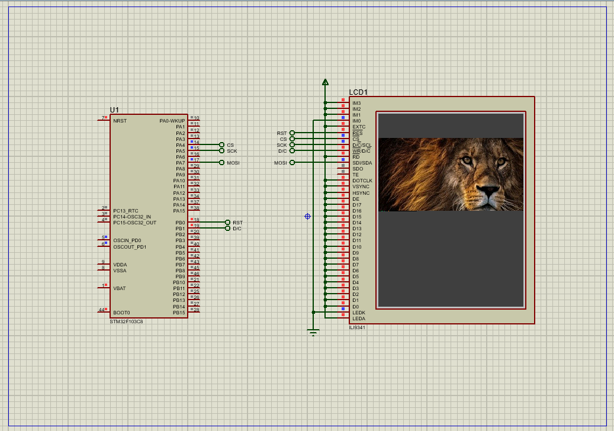

# STM32 ILI9341 Graphics Interface (SPI)

## Hardware Requirements

- **MCU**: STM32F103C8
- **Display**: ILI9341 TFT LCD (240x320)
- **Interface**: SPI
- **Pin Connections**:

  | ILI9341 Pin | STM32 Pin | Function         |
  |-------------|-----------|------------------|
  | CS          | PA4       | Chip Select      |
  | RESET       | PB1       | Reset            |
  | DC/RS       | PB0       | Data/Command     |
  | MOSI        | PA6       | SPI1 MOSI        |
  | SCK         | PA5       | SPI1 SCK         |
  | VCC         | 3.3V      | Power Supply     |
  | GND         | GND       | Ground           |

## Software Requirements

- STM32CubeMX v6.0+
- STM32CubeIDE v1.8+
- Proteus 8 Professional v8.15+ (for simulation)

## Setup Steps

### STM32CubeMX Setup

- Create a new project for **STM32F103C8**
- Go to **Clock Configuration** and set the system clock to **72 MHz**
- Configure **SPI1** as **Transmit Only Master**
- In **SPI1 Parameter Settings**, set the **Prescaler** to **64**
- Configure GPIO Pins:
  - **PA4** as Output (Chip Select)
  - **PB0** as Output (Data/Command - D/C)
  - **PB1** as Output (Reset)
- Generate the initialization code

### STM32CubeIDE

- Create and add the following driver files:
  - `ili9341.h` and `ili9341.c`
  - `ili9341_touch.h` and `ili9341_touch.c` (if touch is supported)
- Implement the following functions:
  - `ILI9341_Init(void)`
  - `ILI9341_Reset(void)`
  - `ILI9341_WriteCommand(uint8_t cmd)`
  - `ILI9341_WriteData(uint8_t data)`
  - `ILI9341_DrawPixel(uint16_t x, uint16_t y, uint16_t color)`
  - `ILI9341_FillScreen(uint16_t color)`
  - `ILI9341_DrawString(...)`, etc.

- Include drawing primitives like:
  - `DrawLine`, `DrawRectangle`, `DrawCircle`, etc.

- Write your application logic in `main.c` to test display initialization and rendering

### In Proteus

- Add:
  - STM32F103C8
  - ILI9341 TFT Display (use generic SPI TFT if custom)
  - Supporting components (resistors, power, etc.)
- Connect pins according to the above configuration
- Load the generated `.hex` firmware and run simulation to verify display output

## Troubleshooting

- **Blank Display**: Confirm Reset and Chip Select logic levels are correctly initialized
- **No Data/Glitches**: Verify SPI Mode 0 and correct prescaler settings
- **Wrong Colors or Orientation**: Check data format (RGB565) and screen rotation settings
- **No Response to Touch Input**: Ensure touch module is powered and SPI/I2C lines configured if using capacitive/resistive touch

## License

MIT License - Free to use with attribution
