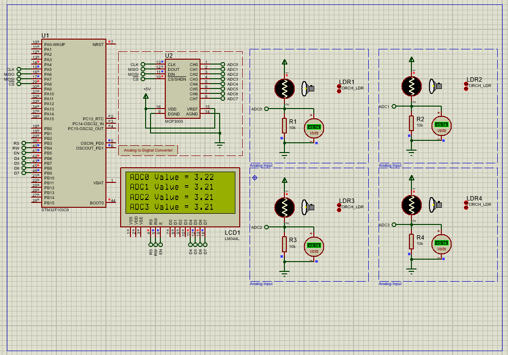

# MCP3008 SPI Interface with STM32F103C6
This project demonstrates how to interface the MCP3008 10-bit ADC with the STM32F103C6 microcontroller using SPI. Analog voltages from four LDR sensors are read and displayed on a 16x2 character LCD. The setup is simulated in Proteus.

## Hardware Requirements

- **MCU**: STM32F103C6 
- **chip**: MCP3008 10-bit ADC (SPI interface)
- **sensor**: 4 × LDR sensors
- **display** : LCD 16x4  
- **Interface**: SPI
- **Pin Connections**:

| MCP3008    | Function      | STM32 Pin |
| ---------- | ------------- | --------- |
| VDD, VREF  | Power         | +3.3V     |
| AGND, DGND | Ground        | GND       |
| CLK        | SPI Clock     | PA5 (SCK) |
| DOUT       | SPI MISO      | PA6       |
| DIN        | SPI MOSI      | PA7       |
| CS/SHDN    | Chip Select   | PA8       |
| CH0–CH3    | Analog Inputs | From LDRs |

| LCD Pin | Function        | STM32 Pin |
| ------- | --------------- | --------- |
| RS      | Register Select | PB5       |
| RW      | Read/Write      | PB6       |
| EN      | Enable          | PB7       |
| D4–D7   | Data Lines      | PB8–PB11  |

## Software Requirements
- STM32CubeMX v6.0+
- STM32CubeIDE v1.8+
- Proteus 8 Professional v8.15+ (for simulation)

## Setup Steps
### STM32CubeMX Setup

- Create a new project for **STM32F103C8**
- Go to **Clock Configuration** and set the system clock to **72 MHz**
- Configure **SPI1** as **Full-Duplex Master**
- In **SPI1 Parameter Settings**, set the **Polarity ** to **Low**
- In **SPI1 Parameter Settings**, set the **Clock Phase ** to **1 Edge**

- Configure GPIO Pins:
  - **PA8** as Output (Chip Select)
  - **PB3 .. PB9** as Output (LCD)
- Generate the initialization code

### STM32CubeIDE

- Create and add the following driver files:
    -MCP3008.h MCP3008.c
    -LiquidCrystal.h LiquidCrystal.c
- Implement the following functions:
  - `void MCP3008_Init(MCP3008_SPI* spi, SPI_HandleTypeDef* hspi, GPIO_TypeDef* CS_PORT, uint16_t CS_PIN);`
  - `uint16_t MCP3008_Read_Channel(MCP3008_SPI* spi, uint8_t channel);`
  - `void noDisplay(void);`
  - `void display(void);`
  - `void blink(void);`
  -....
- Write your application logic in `main.c` 

### In Proteus
  - Connect MCP3008 via SPI (PA5–PA7, PA8)
  - Connect LCD in 4-bit mode to PB5–PB11
  - Connect  LDRs and DC voltmeters
- Load the generated `.hex` firmware and run simulation 

## Troubleshooting

-Ensure SPI settings in CubeMX match MCP3008 requirements
-Confirm all Proteus wiring (especially Chip Select and power)
-LCD not displaying? Check pin order and 10k potentiometer contrast
-Check voltmeter readings and LDR resistance under light changes

## License

MIT License - Free to use with attribution
