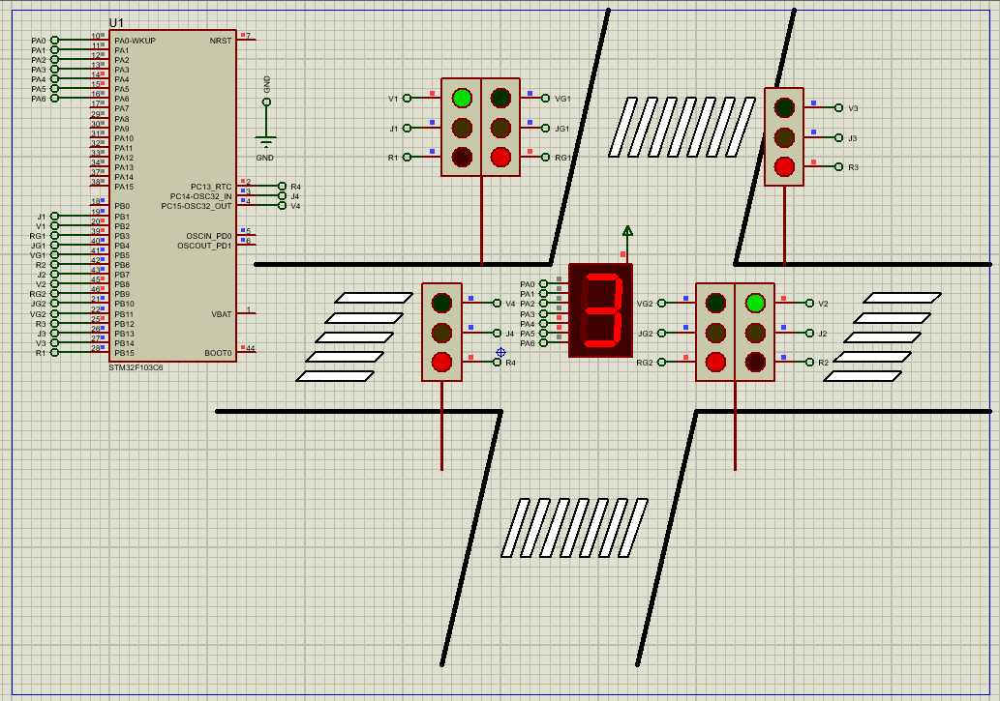

# Traffic Intersection Controller Using STM32F103C6

This project demonstrates how to build a digital traffic intersection management system using the STM32F103C6 microcontroller. The system simulates real-world traffic control using four sets of traffic lights and a 7-segment display for countdown. The entire setup is simulated using Proteus 8.

## Hardware Requirements

- STM32F103C6 Microcontroller  
- 4 × Traffic Light Modules (R, Y, G LEDs)  
- 2 × Mini Traffic Light Modules  
- 1 × 7-Segment Display (Common Anode)  
- Push buttons (optional for pedestrian simulation)  
- Proteus 8.15 or later (for simulation)  
- Power & Ground sources (Proteus Terminal Mode)

## Circuit Overview

- **Main traffic lights:** Control straight and right turns (R1, Y1, G1, etc.)
- **Left-turn signals:** Controlled separately using RG1, JG1, VG1, etc.
- **7-segment display:** Shows countdown (0–9 seconds) during transitions
- **Digital I/O only:** All signals are managed using digital GPIOs

## Software Requirements

- STM32CubeMX (for pin and clock configuration)  
- STM32CubeIDE (to write and build the firmware)  
- HAL library (auto-generated)  
- Proteus 8.15+ (for testing and visualization)

## Setup Steps

### STM32CubeMX Setup

- **Target MCU:** STM32F103C6Tx  
- **Clock Configuration:** Set system clock to 8 MHz  
- **GPIO Configuration:**
  - PB15, PB0–PB5: Full Traffic Light 1 (R1, J1, V1, RG1, JG1, VG1)
  - PB6–PB11: Full Traffic Light 2 (R2, J2, V2, RG2, JG2, VG2)
  - PB12–PB14, PC13–PC15: Mini Traffic Lights 1 & 2 (R3, J3, V3, R4, J4, V4)
  - PA1–PA6: 7-Segment Display (Common Anode)

- **Generate Initialization Code:** Open the project in STM32CubeIDE

### STM32CubeIDE

- Open the generated project
- Implement logic to:
  - Control lighting sequences for all directions
  - Display countdown (5 to 0 seconds) on 7-segment
  - Toggle LEDs and segment patterns using HAL_GPIO_WritePin and ODR registers
- Build and generate the `.hex` file for Proteus simulation

### Proteus Setup

- Create a new project
- Add:
  - STM32F103C6 microcontroller
  - 7SEG-COM-ANODE
  - Traffic Light modules (can use LEDs manually if not available)
- Use **Terminal Mode** for DYNAMIC, POWER, and GROUND
- Load the `.hex` file into the STM32
- Simulate the project and observe traffic sequences and countdown display

## Troubleshooting

- **No lights or display:** Confirm power and ground connections in Proteus
- **Wrong light sequence:** Double-check the logic in the `main.c` state transitions
- **7-segment not counting:** Verify ODR values and correct segment pins (PA1–PA6)
- **Proteus simulation stuck:** Ensure STM32 clock config matches Proteus settings

## License

MIT License — Free to use with attribution.

