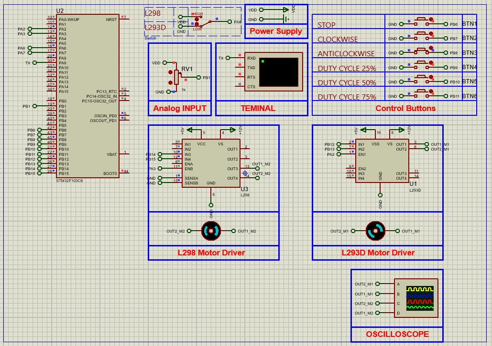

# STM32 Motor Control with L289N & L293D: Advanced Techniques

This project demonstrates how to control DC motors using L289N and L293D motor driver ICs with an STM32F103C6 microcontroller. The setup integrates advanced control techniques such as PWM, ADC-based speed control, UART monitoring, and button-driven direction change. The circuit is simulated using Proteus 8.

## Hardware Requirements

- STM32F103C6 Microcontroller  
- L289N Motor Driver Module  
- L293D Motor Driver IC  
- DC Motors (2)  
- Potentiometer (for speed control)  
- Push Buttons (for direction control)  
- Virtual Terminal (for UART output)  
- Proteus 8.15 or later  
- Power Supply, GND, Oscilloscope (optional)

## Circuit Overview

- **L289N Driver:** Controlled using PA6 (selector), PB14, PB15 (direction), and PA3 (PWM)
- **L293D Driver:** Controlled using PB12, PB13 (direction), and PB6–PB11 (control buttons)
- **ADC (IN9):** Reads potentiometer input for analog speed control
- **TIM2 PWM:** Generates speed-controlled PWM signals on Channel 3 and 4
- **UART1:** Sends ADC reading and motor status to virtual terminal

## Software Requirements

- STM32CubeMX (for configuration)
- STM32CubeIDE (for development and flashing)
- HAL library (auto-generated)
- Proteus 8.15+ (for circuit simulation)

## Setup Steps

### STM32CubeMX Setup

- **Target MCU:** STM32F103C6Tx  
- **Clock:** Set system clock to 8 MHz  
- **GPIO Output Pins:**
  - PA6: Mode Selector (L289N / L293D)
  - PB6–PB11: Direction and speed control buttons
  - PB14, PB15, PA3: L289N control
  - PB12, PB13, PA2: L293D control
- **TIM2 PWM Setup:**
  - Enable TIM2
  - Channels: Enable PWM on CH3 and CH4
  - Prescaler: 800
  - Period: 1000
  - Pulse: 500 (adjustable for speed)
- **ADC1 Configuration:**
  - Enable IN9
  - Enable Continuous Conversion Mode
- **USART1 Setup:**
  - Baud Rate: 9600
  - Mode: Asynchronous
  - Word Length: 8 Bits
  - Stop Bits: 1
  - Parity: None
- **Generate Code** and open in STM32CubeIDE

### STM32CubeIDE Setup

- Initialize all peripherals (GPIO, ADC, PWM, UART)
- Start ADC conversion and PWM outputs
- Read potentiometer value using ADC and adjust PWM duty cycle
- Monitor control buttons for:
  - Direction control (clockwise/anticlockwise)
  - Motor enable/disable
  - Speed control (25%, 50%, 75%)
- Send ADC value to UART for live feedback

### Proteus Simulation

1. Create a new project in Proteus
2. Add:
   - STM32F103C6 MCU
   - L289N and L293D motor driver modules
   - DC Motors
   - Potentiometer
   - Control Buttons (SW-SPDT)
   - RES, VCC, GND
   - Virtual Terminal and Oscilloscope (optional)
3. Wire the circuit according to your CubeMX configuration
4. Load the generated `.hex` file into the STM32 MCU
5. Run the simulation and observe motor behavior and UART output

## Troubleshooting

- **Motor not spinning:** Check enable pins and direction logic
- **Wrong direction:** Verify control pin states (HIGH/LOW)
- **No UART output:** Confirm USART1 is mapped to correct pins and baud rate is 9600
- **Speed not changing:** Ensure ADC channel is correctly assigned and potentiometer is wired properly
- **PWM not working:** Double-check timer setup and output compare channel

## License

MIT License — Free to use with attribution.

