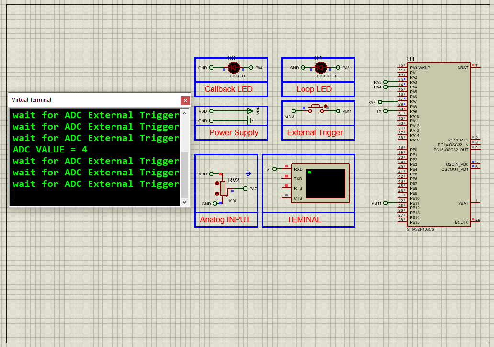

# STM32 External Trigger ADC: Advanced Conversion Techniques

This project demonstrates how to use **external triggers** to control ADC conversions in an STM32F103C6 microcontroller. The system reads analog data from a potentiometer and uses EXTI line interrupts to initiate ADC sampling, with the results displayed over UART. The simulation is implemented in Proteus 8.

## Hardware Requirements

- STM32F103C6 Microcontroller  
- Potentiometer (Analog input)  
- Push Button (External Trigger source)  
- 2 × LEDs (status indicators)  
- Virtual Terminal (for UART output)  
- Proteus 8.15 or newer  
- Power and Ground sources  

## Circuit Overview

- **ADC Channel IN7**: Reads analog voltage from the potentiometer  
- **EXTI Line 11**: Trigger source connected to a button  
- **LED Indicators**:  
  - PA3: Toggles in main loop  
  - PA4: Turns ON during ADC callback  
- **UART Output**: Displays ADC value via Virtual Terminal at 115200 baud  

## Software Requirements

- STM32CubeMX (for project setup and peripheral config)  
- STM32CubeIDE (for code implementation and flashing)  
- HAL library (auto-generated)  
- Proteus 8.15+ (for testing the complete simulation)

## Setup Steps

### STM32CubeMX Setup

- **Target MCU**: STM32F103C6Tx  
- **Clock Configuration**: Set system clock to 8 MHz  
- **GPIO Pins**:  
  - PA2: Output (status LED)  
  - PA3: Output (loop LED)  
- **ADC1 Configuration**:  
  - Enable IN7  
  - Enable **Regular Conversion Mode**  
  - External Trigger Source: EXTI Line 11  
- **NVIC Settings**:  
  - Enable ADC1/ADC2 global interrupts  
  - Enable EXTI Line [15:10] interrupts  
- **UART1 Configuration**:  
  - Baud Rate: 115200  
  - Asynchronous Mode  
  - Word Length: 8 bits  
  - Stop Bits: 1  
  - Parity: None  
- **Generate Code** and open in STM32CubeIDE

### STM32CubeIDE Setup

- Initialize ADC, UART, GPIO, and interrupt handlers  
- Begin ADC in interrupt mode  
- Use EXTI button press to trigger ADC conversion  
- Send ADC value to UART on conversion complete  
- Use LEDs to indicate loop and conversion activity  
- Build the project and generate the `.hex` file

### Proteus Simulation

1. Create a new project  
2. Add:
   - STM32F103C6 MCU
   - Potentiometer connected to ADC IN7
   - Button connected to EXTI Line 11 (e.g. PB11)
   - LEDs (connected to PA3 and PA4)
   - Virtual Terminal (connected to USART1)
3. Use Terminal Mode: DEFAULT, POWER, and GROUND
4. Load the compiled `.hex` file into STM32
5. Run the simulation and trigger ADC using the button
6. Observe LED behavior and UART output in Virtual Terminal

## Troubleshooting

- **No UART Output**: Check baud rate (115200) and TX pin mapping  
- **No ADC Conversion**: Ensure EXTI Line 11 is correctly configured and button is wired  
- **LEDs not responding**: Confirm PA3 and PA4 are set as outputs  
- **Proteus issues**: Match clock frequency and use proper power/ground connections  

## License

MIT License — Free to use with attribution.

