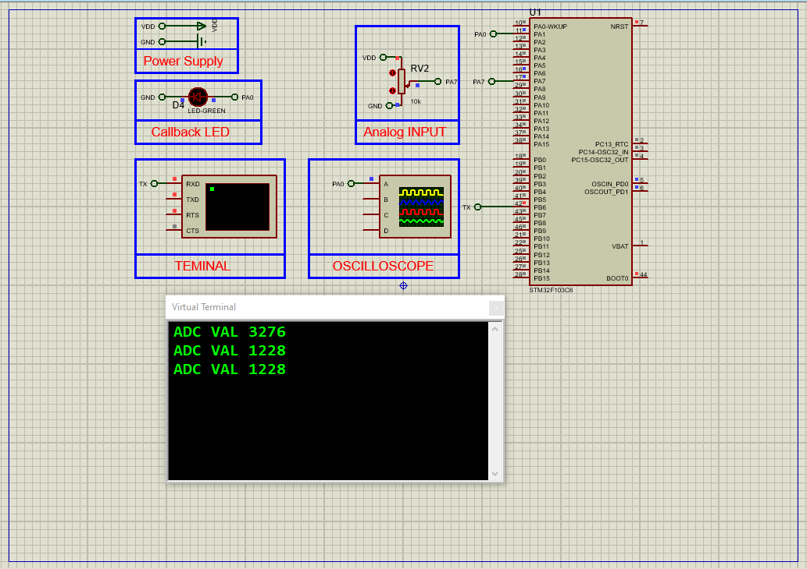

# STM32 TIMER Trigger ADC: Advanced Analog-to-Digital Conversion

This project demonstrates how to use **TIMER triggers** to control ADC conversions in an STM32F103C6 microcontroller. The system reads analog data from a potentiometer synchronously with TIMER3 events, achieving precise 10-second sampling intervals. Results are displayed over UART, and the simulation is implemented in Proteus 8.

## Hardware Requirements

- STM32F103C6 Microcontroller  
- Potentiometer (Analog input: ADC IN7)  
- LED (Status indicator: PA1)  
- Virtual Terminal (for UART output)  
- Proteus 8.15 or newer  
- Power and Ground sources  

## Circuit Overview

- **ADC Channel IN7**: Reads analog voltage from the potentiometer.  
- **TIMER3 Trigger**: Generates periodic events every 10 seconds to start ADC conversions.  
- **LED Indicator (PA1)**: Toggles on each ADC conversion completion.  
- **UART Output**: Displays ADC values via Virtual Terminal at 115200 baud.  

## Software Requirements

- STM32CubeMX (for project setup and peripheral config)  
- STM32CubeIDE (for code implementation and flashing)  
- HAL library (auto-generated)  
- Proteus 8.15+ (for testing the complete simulation)  

## Setup Steps

### STM32CubeMX Setup

- **Target MCU**: STM32F103C6  
- **Clock Configuration**: Set system clock to 8 MHz  
- **GPIO Pins**:  
  - PA1: Output (LED status indicator)  
- **TIMER3 Configuration**:  
  - Enable **Internal Clock** and **One Pulse Mode**  
  - Set **PWM Generation Channel 1** (no physical output)  
  - Counter Settings: Prescaler = 10000, Counter Period = 8000 (10-second interval)  
  - Trigger Output: **Update Event**  
- **ADC1 Configuration**:  
  - Enable IN7  
  - Regular Conversion Mode with **Timer Trigger Event** as external source  
- **UART1 Configuration**:  
  - Baud Rate: 115200  
  - Asynchronous Mode, 8-bit word length, 1 stop bit, no parity  
- **Generate Code** and open in STM32CubeIDE  

### STM32CubeIDE Setup

- Initialize ADC, TIMER, UART, and GPIO peripherals  
- Start ADC in interrupt mode with TIMER trigger  
- Implement ADC conversion complete callback to:  
  - Read and transmit ADC values via UART  
  - Toggle LED (PA1) on each conversion  
- Build the project and generate the `.hex` file  

### Proteus Simulation

1. Create a new project  
2. Add components:  
   - STM32F103C6 MCU  
   - Potentiometer connected to ADC IN7 (PA7)  
   - LED connected to PA1  
   - Virtual Terminal (connected to USART1 TX - PA9)  
3. Configure power and ground connections  
4. Load the compiled `.hex` file into STM32  
5. Run simulation and observe:  
   - ADC values in Virtual Terminal every 10 seconds  
   - LED toggling with each conversion  

## Troubleshooting

- **No UART Output**: Verify baud rate (115200) and TX pin (PA9) connections  
- **ADC Not Triggering**: Check TIMER3 prescaler/period settings (10000/8000 for 10-second intervals)  
- **LED Not Toggling**: Confirm PA1 is configured as output and callback is triggered  
- **Proteus Issues**: Ensure 8 MHz clock frequency and proper power connections  

## License

MIT License — Free to use with attribution.

