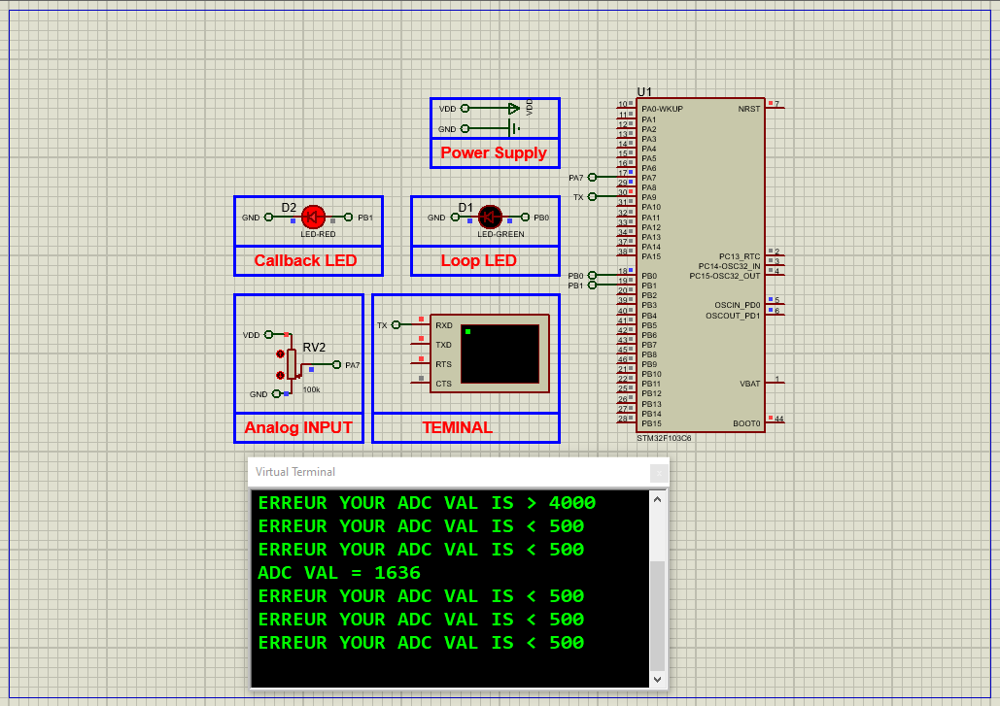

# STM32 ADC Watchdog: Advanced Analog-to-Digital Conversion

This project demonstrates the **ADC Watchdog** feature in STM32 microcontrollers, which monitors analog input voltages against predefined thresholds and triggers interrupts for out-of-range values. The system reads a potentiometer via ADC1, detects voltage anomalies, and alerts via UART and LEDs. Simulation is implemented in Proteus 8.

## Hardware Requirements  
  
- **STM32F103C6 Microcontroller**  
- **Potentiometer** (Analog input: ADC1 channel)  
- **2× LEDs** (Status indicators: PB0 for loop, PB1 for watchdog alerts)  
- **Virtual Terminal** (UART1 output at 115200 baud)  
- **Proteus 8.15+**  
- **Power/Ground sources**  

## Circuit Overview  
- **ADC Channel**: Potentiometer connected to ADC1 (e.g., PA0).  
- **Watchdog Thresholds**:  
  - High: 3000 mV  
  - Low: 500 mV  
- **LEDs**:  
  - PB0: Toggles in main loop  
  - PB1: Activates on watchdog alert  
- **UART**: Transmits ADC values and threshold violations (PA9-TX).  

## Software Requirements  
- **STM32CubeMX** (Configuration)  
- **STM32CubeIDE** (Code implementation)  
- **HAL Library**  
- **Proteus 8.15+** (Simulation)  

## Configuration Steps  

### STM32CubeMX Setup  
1. **MCU Selection**: STM32F103C6 (8 MHz clock).  
2. **GPIO**:  
   - PB0, PB1 as outputs (LEDs).  
3. **ADC1**:  
   - Enable regular conversion mode.  
   - Activate **Analog Watchdog** with thresholds (Low=500, High=3000).  
   - Enable interrupts.  
4. **UART1**: Asynchronous mode, 115200 baud, 8-bit data.  
5. **Generate Code** in CubeIDE.  

### STM32CubeIDE Implementation  
#### Key Functions:  
1. **ADC Initialization**:  
   - Configure watchdog thresholds via `HAL_ADC_AnalogWDGConfig()`.  
2. **Interrupt Callback**:  
   - `HAL_ADC_LevelOutOfWindowCallback()`: Triggers LED (PB1) and UART alert on threshold violation.  
3. **Main Loop**:  
   - Poll ADC values and toggle PB0 LED.  
   - Transmit ADC readings via UART.  

### Proteus Simulation  
1. **Components**:  
   - STM32F103C6, Potentiometer, 2× LEDs, Virtual Terminal.  
2. **Connections**:  
   - Potentiometer → ADC1 channel (PA0).  
   - PB0/PB1 → LEDs.  
   - UART1-TX (PA9) → Virtual Terminal.  
3. **Simulation**:  
   - Load `.hex` file.  
   - Monitor terminal for ADC values and alerts when potentiometer exceeds thresholds.  

## Troubleshooting  
- **No UART Output**: Verify baud rate (115200) and TX pin (PA9).  
- **Watchdog Not Triggering**: Check threshold values and ADC channel configuration.  
- **LEDs Inactive**: Confirm GPIO pins (PB0/PB1) are outputs.  

## License  
**MIT License** — Free to use with attribution.  

