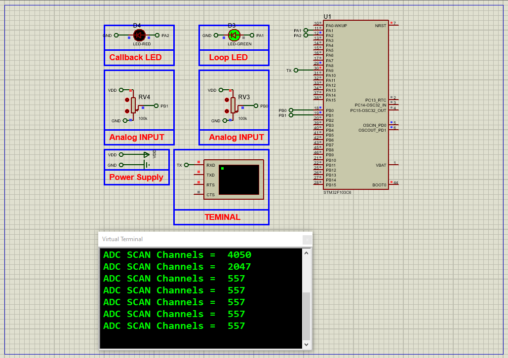

# STM32 ADC Scan Mode: Advanced Analog-to-Digital Conversion

This project demonstrates the **ADC Scan Mode** feature in STM32 microcontrollers, enabling automated sequential sampling of multiple analog channels. The system reads two potentiometers via ADC1 channels 8 and 9, transfers data via DMA, and displays results over UART. Simulation is implemented in Proteus 8.

## Hardware Requirements  
  
- **STM32F103C6 Microcontroller**  
- **2× Potentiometers** (Analog inputs: ADC1 channels 8 & 9)  
- **2× LEDs** (Status indicators: PA1 for scan completion, PA2 for loop)  
- **Virtual Terminal** (UART1 output at 115200 baud)  
- **Proteus 8.15+**  
- **Power/Ground sources**  

## Circuit Overview  
- **ADC Channels**:  
  - Potentiometer 1 → ADC1 Channel 8 (e.g., PB0)  
  - Potentiometer 2 → ADC1 Channel 9 (e.g., PB1)  
- **DMA**: Automates data transfer to SRAM.  
- **LEDs**:  
  - PA1: Toggles on scan completion  
  - PA2: Indicates main loop activity  
- **UART**: Transmits scanned ADC values (PA9-TX).  

## Software Requirements  
- **STM32CubeMX** (Configuration)  
- **STM32CubeIDE** (Code implementation)  
- **HAL Library**  
- **Proteus 8.15+** (Simulation)  

## Configuration Steps  

### STM32CubeMX Setup  
1. **MCU Selection**: STM32F103C6 (8 MHz clock).  
2. **GPIO**:  
   - PA1, PA2 as outputs (LEDs).  
3. **ADC1**:  
   - Enable **Scan Conversion Mode**.  
   - Configure 2 conversions: Channels 8 & 9 (Rank 1 & 2).  
   - Set trigger source: **Software start**.  
4. **DMA**: Enable for ADC1 (Circular mode, 16-bit width).  
5. **UART1**: Asynchronous mode, 115200 baud, 8-bit data.  
6. **Generate Code** in CubeIDE.  

### STM32CubeIDE Implementation  
#### Key Functions:  
1. **DMA Initialization**:  
   - `HAL_ADC_Start_DMA()` for automatic data transfer.  
2. **Conversion Callback**:  
   - `HAL_ADC_ConvCpltCallback()`: Toggles PA1 LED on scan completion.  
3. **Main Loop**:  
   - Transmit ADC values via UART using `HAL_UART_Transmit()`.  
   - Toggle PA2 LED periodically.  

### Proteus Simulation  
1. **Components**:  
   - STM32F103C6, 2× Potentiometers, 2× LEDs, Virtual Terminal.  
2. **Connections**:  
   - Potentiometers → ADC1 Channels 8 & 9 (PB0/PB1).  
   - PA1/PA2 → LEDs.  
   - UART1-TX (PA9) → Virtual Terminal.  
3. **Simulation**:  
   - Load `.hex` file.  
   - Observe terminal for sequential ADC values from both channels.  

## Troubleshooting  
- **UART Silence**: Check baud rate (115200) and TX pin (PA9).  
- **Incomplete Scans**: Verify DMA configuration and channel ranks.  
- **LEDs Inactive**: Confirm GPIO pins (PA1/PA2) are outputs.  

## License  
**MIT License** — Free to use with attribution.  

